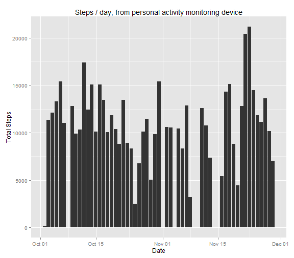
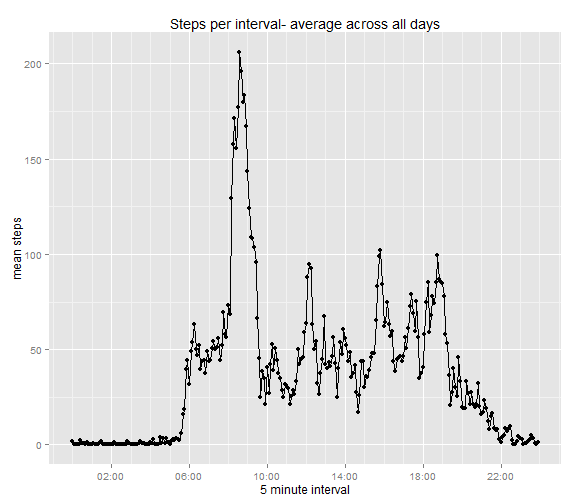
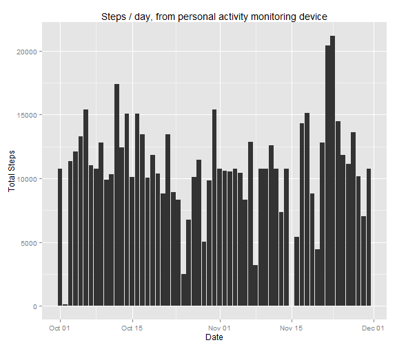
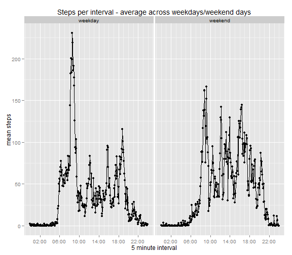

<!-- rmarkdown v1 -->

## Loading and preprocessing the data

First let's download, unzip and read in the csv file to a dataframe 'myData'.

```r
setInternet2(use = TRUE)
fileUrl <- "https://d396qusza40orc.cloudfront.net/repdata%2Fdata%2Factivity.zip"
zipFile <- "repdata_data_activity.zip"
download.file(fileUrl, destfile=zipFile)
dateDownloaded <- date()
myFile <- unzip(zipFile)
myData <- read.csv(myFile,stringsAsFactors=FALSE)
```

## Inspect the data

Let's get the basics

```r
str(myData)
```

```
## 'data.frame':	17568 obs. of  3 variables:
##  $ steps   : int  NA NA NA NA NA NA NA NA NA NA ...
##  $ date    : chr  "2012-10-01" "2012-10-01" "2012-10-01" "2012-10-01" ...
##  $ interval: int  0 5 10 15 20 25 30 35 40 45 ...
```

```r
head(myData)
```

```
##   steps       date interval
## 1    NA 2012-10-01        0
## 2    NA 2012-10-01        5
## 3    NA 2012-10-01       10
## 4    NA 2012-10-01       15
## 5    NA 2012-10-01       20
## 6    NA 2012-10-01       25
```
How many unique values for each variable?

```r
sapply(myData,function (x) length(unique(x)))
```

```
##    steps     date interval 
##      618       61      288
```

It looks like we need to do a bit of tidying and formatting. Before that let's convert the dataframe to a data.table


```r
require(data.table)
DT <- data.table(myData)
```

Let's rework the interval string into a time format eg HH:MM for time series analysis

```r
require(stringr)
## pad 'interval' with leading zeros in preparation for converting to time class
DT[,interval:=str_pad(interval,4,"left","0")]
## str_insert function adapted from 1st post of SO thread
## http://stackoverflow.com/questions/13863599/insert-a-character-at-a-specific-location-in-a-string
# x is the text object, n is the position to insert, text is the replacement string
str_insert <- function(x,n,text) {
        paste0(substr(x, 1, n-1), text, substr(x, n, nchar(x)))
}
DT[,interval:=str_insert(interval,n=3,text=":")]
## now we have it in HH:MM format can convert to time from format %R
DT[,interval:=as.POSIXct(strptime(interval,"%R"))]
```
Converting to as.POSIXct class has the side-effect of prepending today's date, so you get for example: 2015-01-19 00:05:00, but it is not a problem for analysis and enables data to be treated as continuous for time-series charting.

Next, let's fix the classes of the other variables:
- convert date to date class
- convert steps to numeric class

```r
DT[,date:=as.Date(date)]
DT[,steps:=as.numeric(steps)] ## handy to support imputation of mean values later
```
## What is mean total number of steps taken per day?

Now let's see a histogram of the total number of steps taken per day for the measured individual, as recorded using a personal activity monitoring device.
The period of measurement was 2012-10-01 to 2012-11-30.


```r
require(ggplot2)
## filter out any NA values for steps, then sum steps for each date
plot1 <- DT[!is.na(steps),.(sumsteps=sum(steps)),by=date]
## then plot the results
ggplot(plot1,aes(date,sumsteps)) + geom_bar(stat="identity") +
        labs(x="Date",y="Total Steps",
            title="Steps / day, from personal activity monitoring device")
```

 

For the total period, excluding all NAs, the mean & median steps per day were as follows:

```r
mean(plot1[,sumsteps])
```

```
## [1] 10766.19
```

```r
median(plot1[,sumsteps])
```

```
## [1] 10765
```

## What is the average daily activity pattern?

Let's plot the average steps per 5 minute interval across all days (excluding NA values once again).


```r
## load package for date/time axis scale
require(scales)
## Get the mean steps per interval, excluding NA rows
plot2 <- DT[!is.na(steps),.(meansteps=mean(steps)),by=interval]
## identify the maximum value - time and no. of steps
maxinterval <- plot2[which.max(meansteps),interval] 
maxsteps <- max(plot2[,meansteps])
## plot the time series
ggplot(aes(interval,meansteps),data=plot2) + 
        geom_point() + geom_line() + 
        labs(x="5 minute interval", y="mean steps",
             title="Steps per interval- average across all days") +
        scale_x_datetime(breaks=date_breaks("4 hour"),
                         minor_breaks = date_breaks("1 hour")
                         ,labels = date_format("%R"))
```

 


```r
round(maxsteps) ## max steps
```

```
## [1] 206
```

```r
strftime(maxinterval,format="%R") ## the time interval when this occurs
```

```
## [1] "08:35"
```

Average steps per interval peaks at 206 to the nearest step, at  08:35.

## Imputing missing values

First let's look at NA values.


```r
require(questionr) ## package with handy cross tabulation functions
tab <- suppressWarnings(freq.na(DT)) ## frequency table of NAs by variable
tab
```

```
##          missing  %
## steps       2304 13
## date           0  0
## interval       0  0
```

```r
sum(is.na(DT)) ## Total NAs in the dataset
```

```
## [1] 2304
```
There are a total of 2304 NAs in the dataset.

The dates where there are NAs are as follows:

```r
nasbydate <- DT[,anyNA(steps),by=date] ## lists which days have nas
nalogical <- nasbydate$V1==T
nasbydate[nalogical,date]
```

```
## [1] "2012-10-01" "2012-10-08" "2012-11-01" "2012-11-04" "2012-11-09"
## [6] "2012-11-10" "2012-11-14" "2012-11-30"
```

Now we need to impute missing values. The strategy we will use is to replace NAs for any given time interval with that time interval's mean across all days observed. That way we should not affect overall mean values.


```r
## strategy will be to recycle means for each time interval in place of NAs
newDT <- copy(DT) ## make a copy of the dataset where we add imputed values
setkeyv(newDT,c("date","interval")) ## ensure keyed and ordered before merging
## create a new column 'meansteps' with the overall mean steps for each time interval
## across all days (already calculated for plot2)
## use "interval" as merge key
result <- merge(newDT,plot2,by=c("interval"))
setkeyv(result,c("date","interval"))
## where steps = NA, replace with the meansteps value for same interval
result[is.na(steps),steps:=meansteps]
result[,meansteps:=NULL] ## tidy up our temp merging column
```

Let's look at a histogram of this dataset including imputed values.

```r
plot3 <- result[,.(sumsteps=sum(steps)),by=date]
## then plot the results
ggplot(plot3,aes(date,sumsteps)) + geom_bar(stat="identity") +
        labs(x="Date",y="Total Steps",
            title="Steps / day, from personal activity monitoring device")
```

 

Let's compare the means and medians from the adjusted dataset("with imputation"), the original dataset (without)


```r
mean_with <- mean(plot3[,sumsteps])
mean_without <- mean(plot1[,sumsteps])
print(paste("Mean with:",mean_with,"   Mean without:",mean_without))
```

```
## [1] "Mean with: 10766.1886792453    Mean without: 10766.1886792453"
```
The imputation strategy determines that the means should not differ.

```r
median_with <- median(plot3[,sumsteps])
median_without <- median(plot1[,sumsteps])
print(paste("Median with:",median_with,"   Median without:",median_without))
```

```
## [1] "Median with: 10766.1886792453    Median without: 10765"
```

```r
median_with - median_without ## the difference (with-without)
```

```
## [1] 1.188679
```
The effect of imputation using the means is to create more days around the central result so the median is likely to be moved towards the mean by this process.
The difference between medians is 1.1886792 (with-without).

## Are there differences in activity patterns between weekdays and weekends?

First let's classify dates into weekday / weekend in a new variable 'day' and append to the with-imputation dataset ('result').


```r
## for wday function, 1 is sunday, 7 is saturday
result[wday(date)%in%(c(7,1)),day:="weekend"]
result[wday(date)%in%(c(2:6)),day:="weekday"]
result[,day:=as.factor(day)]
```

Now let's calculate the data and plot the results to compare.


```r
plot4 <- result[,.(meansteps=mean(steps)),by=.(day,interval)]
ggplot(aes(interval,meansteps),data=plot4) + geom_point() + geom_line() +
        facet_grid(.~day) +
        labs(x="5 minute interval", y="mean steps",
             title="Steps per interval - average across weekdays/weekend days") +
        scale_x_datetime(breaks=date_breaks("4 hour"),
                         minor_breaks = date_breaks("1 hour")
                         ,labels = date_format("%R"))
```

 


